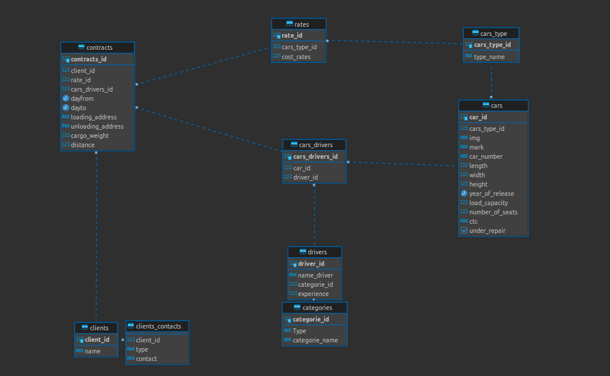

# CRM для оператора грузовых перевозок
Одна из **ранних** версий, которую можно показать, так как разрабатывалась специально под клиента.


Реализована сложная бизнес логика машин и водителей, свободных и находящихся в рейсе.  

Можно добавлять новых водителей и новые машины. Менять параметры уже существующих машин. Добавление нового рейса учитывает категорию водителя, свободен ли водитель, свободна ли машина, водите ли эту машину этот водитель, подходящия ли категория у водителя.
Также можно распечатать прототип накладной.


## Стек технологий:
```
python3.8
postgeresql
PyQt5
```


## Интрерфейс


Накладная выдаётся в виде html страницы, которую в дальгнейшем легко конвертировать в pdf.

## Схема базы данных



## Как установить 
```
pip install -r requirements.txt
```


Создать базу данных на постгрес. Код sql для созданий базы находиться в sql.txt. Базы имеют связи поэтому просто запустить файл не получится. Следует смотреть на схему БД и создавать поочерёдно.


Для коннекта python и postgresql следует поменять функцию **con** в файлах.